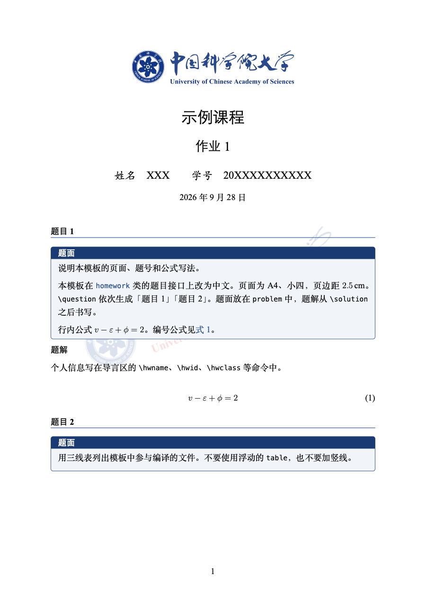
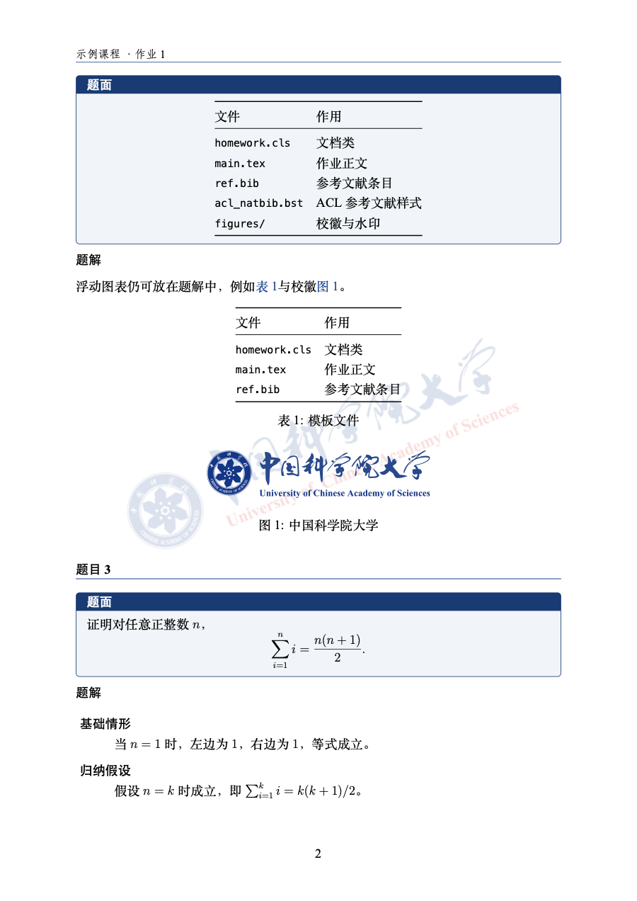
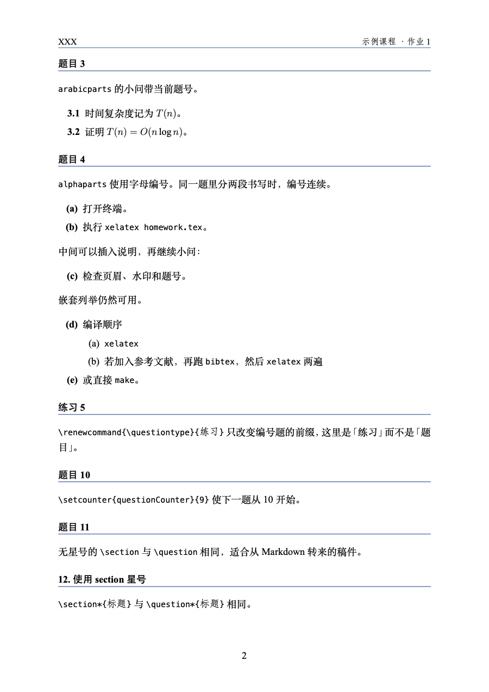
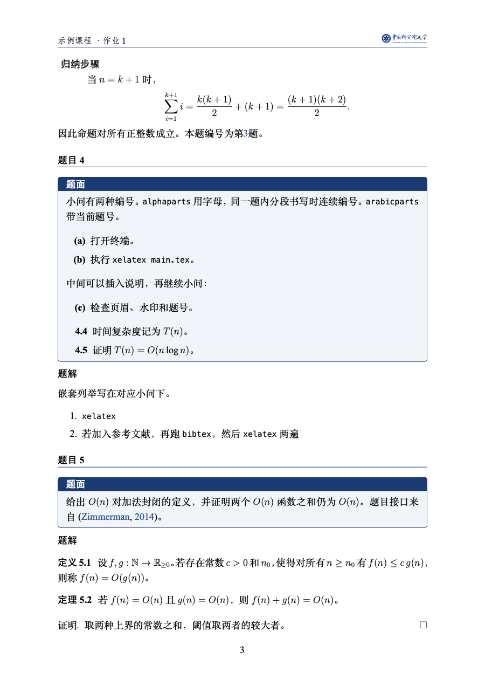

# 国科大平时作业模板

中文 LaTeX 作业文档类。A4、小四、页边距 2.5 cm。文首为国科大校徽，页眉为「课程 · 作业序号」。题目按「题目 1」「题目 2」编号。题面放在浅蓝底框中，题解写在框外。

## 下载

- [Download ZIP](https://github.com/Hepisces/ucas-latex-homework/archive/refs/heads/main.zip)
- 或克隆本仓库：

```bash
git clone https://github.com/Hepisces/ucas-latex-homework.git
```

完整仓库含示例、预览图和说明。若只把一次作业拷到另一台机器或 Overleaf，用下面的打包脚本。

## 文件

| 文件 | 作用 |
| --- | --- |
| `homework.cls` | 文档类 |
| `main.tex` | 作业起点，复制或直接改这份 |
| `homework.tex` | 功能示例，对应下面的两份 PDF |
| `ref.bib` | 参考文献条目 |
| `acl_natbib.bst` | ACL 参考文献样式 |
| `figures/` | 文首校徽与水印图 |
| `figures/preview/` | README 用的页面预览，不参与编译 |
| `pack_sources.py` | 只打包编译所需文件 |
| `.vscode/settings.json` | VS Code 的 XeLaTeX 编译配置 |

## 使用

安装 [TeX Live](https://www.tug.org/texlive/)，编译器使用 XeLaTeX。TeX Live 另带一份同名 [`homework`](https://ctan.org/pkg/homework) 文档类，请在本目录中编译，让仓库内的 `homework.cls` 优先生效。

1. 编辑 `main.tex` 顶部的课程、姓名、学号和作业序号。
2. 每道题用 `\question`。题面写入 `problem`，题解从 `\solution` 之后写。
3. 在 VS Code 中打开整个模板文件夹，使用 [LaTeX Workshop](https://github.com/James-Yu/LaTeX-Workshop) 编译。仓库中的 `.vscode/settings.json` 默认选择 `latexmk (XeLaTeX, automatic bibliography)` 配方，自动完成 XeLaTeX 多轮编译，并在需要时运行 BibTeX。

工作区配置关闭了魔法注释对配方的切换，默认调用 `/Library/TeX/texbin/latexmk`。这是 macOS 上 MacTeX 的标准路径；使用其他安装路径时，将 `command` 改为本机的 `latexmk` 路径，或在已配置 PATH 时改为 `latexmk`。复制模板到课程目录时，一并复制 `.vscode/settings.json` 到 VS Code 打开的文件夹根目录。

需要参考文献时，在正文中使用 `\cite`、`\citep` 或 `\citet`，并在文末加入：

```latex
\bibliography{ref}
```

要列出 `ref.bib` 中的全部条目，可在前面加上 `\nocite{*}`。没有参考文献时，删除文末的 `\nocite{*}` 和 `\bibliography{ref}`，`latexmk` 会自动跳过 BibTeX。

`make` 只作辅助，它调用 `latexmk -xelatex`，同样会在需要时跑 BibTeX。上传到 [Overleaf](https://www.overleaf.com) 时，编译器选择 XeLaTeX。

只带走能编译的文件：

```bash
python pack_sources.py
```

生成的 `ucas-homework-src.zip` 含 `main.tex`、`*.cls`、`*.sty`、`*.bib`、`*.bst`，以及 `figures/` 里除 `preview/` 以外的图片。不含 `homework.tex`、预览图和示例 PDF。

## 导言区

| 命令 | 含义 |
| --- | --- |
| `\hwclass` | 课程名，出现在文首和页眉 |
| `\hwtype` `\hwnum` | 作业类型与序号，页眉形如「课程 · 作业 1」 |
| `\hwname` `\hwid` | 姓名、学号 |
| `\hwemail` | 邮箱，留空则不显示 |
| `\hwdate` | 日期，默认当天 |

```latex
\newcommand{\hwclass}{算法设计与分析}
\newcommand{\hwtype}{作业}
\newcommand{\hwnum}{1}
\newcommand{\hwname}{张三}
\newcommand{\hwid}{202600000000000}
```

## 水印与页眉

默认每页有淡化校徽水印，页眉只有「课程 · 作业序号」。文首校徽不随这个开关变化。

关闭水印：

```latex
\documentclass[nowatermark]{homework}
```

此时改为双面页眉。偶数页外侧是姓名，奇数页外侧是校徽，内侧仍是「课程 · 作业序号」。`anonymous` 时正文页眉不印姓名。

水印图是 `figures/ucas_watermark.png`。需要在水印上再叠一行校名时：

```latex
\renewcommand{\hwmarktext}{中国科学院大学}
\renewcommand{\hwtextopacity}{0.08}
\renewcommand{\hwtextrotation}{22}
```

## 样例

示例源文件是 `homework.tex`。两份 PDF 用同一份源文件，只差有没有水印。

### 有水印

[homework.pdf](homework.pdf)

<p align="center">
  
  
</p>

### 无水印

[homework-nowatermark.pdf](homework-nowatermark.pdf)

偶数页页眉外侧为姓名，奇数页页眉外侧为校徽。

<p align="center">
  
  
</p>

## 题目

编号题用 `\question`，得到「题目 1」「题目 2」。题面和题解分开写：

```latex
\question
\begin{problem}
在此填写题面。
\begin{threetab}{lr}
  词项 & 文档频率 df \\
  \midrule
  dragon & 66{,}000 \\
\end{threetab}
\end{problem}
\solution
在此填写题解。
```

`problem` 是浅蓝底、校色标题栏的盒子，标题为「题面」，可以跨页。`threetab` 的参数是列格式，不要加竖线。表留在当前题内，不使用浮动的 `table`。线只有 `\toprule`、`\midrule`、`\bottomrule`。

`\question*{归纳：等差数列求和}` 生成带名称的题目，仍占用题号。`\section` 与 `\question` 等价，`\section*{标题}` 与 `\question*{标题}` 等价。`\renewcommand{\questiontype}{练习}` 把前缀改成「练习」。`\setcounter{questionCounter}{9}` 使下一题从 10 开始。

小问：

```latex
\begin{alphaparts}
  \questionpart
    这是 (a)。
  \questionpart
    这是 (b)。
\end{alphaparts}

\begin{arabicparts}
  \questionpart
    这是「题号.1」。
\end{arabicparts}
```

同一题里多次使用 `alphaparts` 时，字母连续编号。`arabicparts` 带当前题号。

归纳证明写在题解中：

```latex
\begin{induction}
  \basecase ...
  \indhyp   ...
  \indstep  ...
\end{induction}
```

`\answerbox{4cm}` 留出给定高度的空白。`\tbox{文字}` 是浅灰提示框。定理环境为 `theorem`、`lemma`、`corollary`、`proposition`、`definition`、`example`，证明用 `proof`，编号挂在当前题目下。

这些写法的完整稿在 `homework.tex`。英文原接口见 [latex-homework-class](https://github.com/jez/latex-homework-class) 的 [README](https://github.com/jez/latex-homework-class/blob/master/README.md)。

## 参考文献

样式取自 [ACL LaTeX 模板](https://github.com/acl-org/acl-style-files) 的 `acl_natbib.bst`，为作者-年格式。节标题是「参考文献」。条目写在 `ref.bib`。

```latex
见 \citep{zimmerman2014homework} 与 \citet{zimmerman2014homework}。

\bibliography{ref}
```

`\cite` 与 ACL 模板一样，等于 `\citep`。没有引用时不要写 `\bibliography{ref}`。

## 选项

```latex
\documentclass[anonymous,newpage,largemargins,nowatermark]{homework}
```

| 选项 | 作用 |
| --- | --- |
| `nowatermark` | 关闭水印，改用双面页眉 |
| `anonymous` | 姓名、学号只出现在扉页，正文页眉不印姓名 |
| `newpage` | 每题从新页开始 |
| `largemargins` | 加宽页边距 |

图片放在 `figures/`，用文件名引用即可，例如 `\includegraphics{ucas_logo.pdf}`。

## 来源与许可

除 [NOTICE](NOTICE) 所列校徽文件外，本仓库以 [MIT License](LICENSE) 授权。题目接口改写自 Jacob Zimmerman, [*latex-homework-class*](https://github.com/jez/latex-homework-class) (2014)，原许可见该仓库的 [LICENSE](https://github.com/jez/latex-homework-class/blob/master/LICENSE)。

校徽取自 [jweihe, 国科大课程论文模板](https://github.com/jweihe/UCAS_Latex_Template)，按 [CC BY 4.0](https://creativecommons.org/licenses/by/4.0/) 使用。原文件、衍生文件与改动写在 [NOTICE](NOTICE) 中。参考文献样式取自 [acl-org/acl-style-files](https://github.com/acl-org/acl-style-files) 的 `latex/acl_natbib.bst`。

引用信息见 [CITATION.cff](CITATION.cff)。
